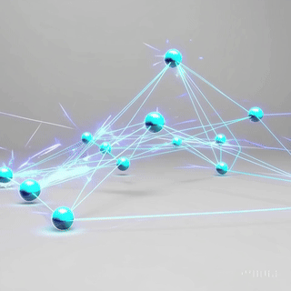
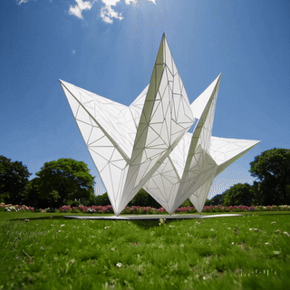

<!-- 🌌 Ebru's Living Portfolio -->

<h1 align="center">🌿 Math, Light & Architecture</h1>

<!-- 🌌 Animated Visual Gallery (correct paths) -->

  
  
  
  

  Interconnected ideas — where mathematics becomes motion, architecture meets logic, and light shapes design.

---

---

### 👋 Hi, I'm Ebru  
🎓 MSc in Applied Mathematics  
💡 Data Science · Financial AI · Architectural Geometry  
📍 Based in Bodrum, Turkey  

---

## 🪶 About Me
I combine **mathematics, architecture, and AI** — translating abstract concepts into visual and analytical systems.  
My background blends **financial modeling, data analysis, and structural aesthetics** inspired by geometry and light.  

✨ *“Mathematics is the architecture of logic — and architecture is mathematics made visible.”*

---

## 🩵 About My Work
I design **intelligent mathematical systems** that don’t just compute — they *express*.  
My focus lies in the intersection of:
- 📈 **Finance** — forecasting risks and returns with deep learning  
- 🧠 **AI** — building interpretable Transformer architectures  
- 🏗️ **Architecture** — parametric, origami-inspired geometry  
- 🔷 **Art** — transforming patterns of thought into visuals  

> *“Form follows data.”*  
> — My philosophy for every model, structure, and design.

---

## 🔮 Research & Analytical Projects

### [Financial-Risk-Prediction](https://github.com/mathwithebru-finansal/Financial-Risk-Prediction)
Multi-Task Transformer predicting **returns** & **volatility** across multiple financial assets.  
`Python · PyTorch · Pandas · Matplotlib · SHAP`

---

### [Graph-Theory-Centrality](https://github.com/mathwithebru-finansal/Graph-Theory-Centrality)
Visual and mathematical exploration of **Eigenvector** and **Betweenness Centrality**.  
`NetworkX · Matplotlib · Linear Algebra`

---

### [CNN-Art-Style-Transfer](https://github.com/mathwithebru-finansal/CNN-Art-Style-Transfer)
Merging art and machine learning — reinterpreting **visual style** through CNN layers.  
`PyTorch · VGG19 · Image Processing`

---

## 🩶 Architectural Explorations
*Where structure becomes art and math becomes form.*

<table>
  <tr>
    <td align="center">
      
       <b>Parametric Pavilion</b> 
      Generated by mathematical curvature and light simulation.
    </td>
    <td align="center">
      
       <b>Overwater Geometry</b> 
      Geometry meets balance — financial patterns in space.
    </td>
    <td align="center">
      
       <b>Origami Canopy (Night)</b> 
      Folded surfaces illuminated with linear gradients and shadows.
    </td>
  </tr>
</table>
<!-- Hide contribution graph visually -->

  

